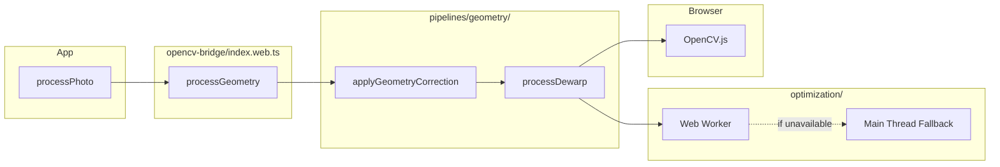
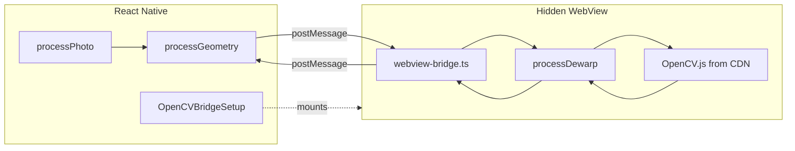
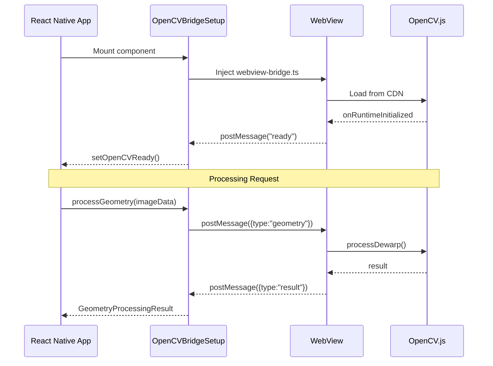
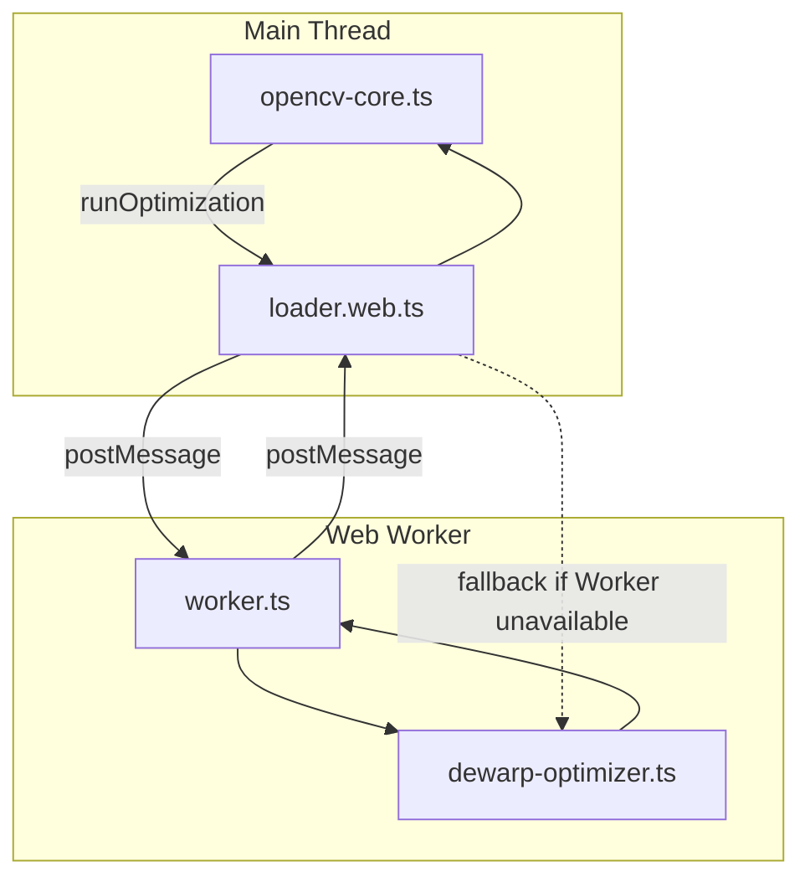

# Photo Processor

Platform-agnostic image processing library for React Native and Web. Provides geometry correction (page dewarping) with a unified API across platforms.

## Overview

This library processes photos through configurable pipelines. The geometry correction algorithm is a web-compatible implementation based on [page-dewarp-js](https://github.com/erykpiast/page-dewarp-js), which detects curved page boundaries, estimates 3D page shape, and generates flattened output.

The key challenge is running OpenCV.js across platforms:

- **Web**: OpenCV.js runs directly in the browser
- **Native (iOS/Android)**: OpenCV.js runs inside a hidden WebView, with message-passing to React Native

## Directory Structure

```
photo-processor/
├── index.ts                 # Main entry point: processPhoto()
├── types.ts                 # Type definitions
├── config.ts                # Default dewarp configuration
│
├── opencv-bridge/           # Platform-specific OpenCV loading
│   ├── index.ts             # Platform resolution (→ .native or .web)
│   ├── index.native.tsx     # React Native WebView bridge
│   ├── index.web.ts         # Direct browser OpenCV
│   ├── webview-bridge.ts    # Code injected into WebView
│   └── types.ts             # Bridge message types
│
├── optimization/            # CPU-intensive optimization code
│   ├── dewarp-optimizer.ts  # Span refinement + cubic sheet fitting
│   ├── loader.web.ts        # Web Worker loader with fallback
│   └── worker.ts            # Worker entry point (bundled dynamically)
│
├── pipelines/               # Processing pipelines
│   ├── index.ts             # Pipeline exports
│   └── geometry/            # Geometry correction pipeline
│
└── utils/                   # Utilities
    └── loadImageAsDataUrl.* # Platform-specific image loading
```

## Platform Resolution

Metro bundler automatically resolves platform-specific files:

| Import                       | Web                         | Native                         |
| ---------------------------- | --------------------------- | ------------------------------ |
| `./opencv-bridge`            | `index.web.ts`              | `index.native.tsx`             |
| `./utils/loadImageAsDataUrl` | `loadImageAsDataUrl.web.ts` | `loadImageAsDataUrl.native.ts` |

## Data Flow

### Web Platform



### Native Platform (iOS/Android)



## OpenCV Bridge

### Native Implementation

On native platforms, OpenCV.js cannot run directly in React Native's JavaScript engine. Instead:

1. **`OpenCVBridgeSetup`** renders a hidden `<WebView>` component
2. The WebView loads `webview-bridge.ts` (bundled by Metro) + OpenCV.js from CDN
3. When OpenCV is ready, it sends a `"ready"` message
4. Processing requests are sent via `postMessage`, results returned the same way



### Web Implementation

On web, OpenCV.js loads directly in the browser on-demand. CPU-intensive optimization runs in a Web Worker (with main-thread fallback if workers are unavailable).

## Optimization Worker

The dewarp algorithm has CPU-intensive phases (span refinement, cubic sheet fitting) that would block the UI. On web, these run in a Web Worker:



The worker is bundled dynamically by the Metro transformer at build time—no manual rebuild needed.

## Pipeline Structure

The processing pipeline is designed for extensibility. Currently only geometry correction is implemented. Future phases (lighting, clarity) can be added as additional pipeline stages.

Each pipeline phase receives a `DataUrl` image, applies transformations, and returns a processed `DataUrl`.

## Metro Configuration

A custom transformer (`metro-workers-transformer.js`) uses esbuild to bundle TypeScript files that need to run in isolated contexts:

- **`webview-bridge.ts`** → bundled as string for WebView injection (native)
- **`worker.ts`** → bundled as string for Web Worker creation (web)

This allows both the native bridge and web worker loader to import the bundled code as strings without a separate build step.
