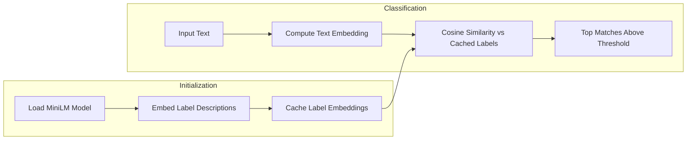

# Switch to MiniLM Sentence Embeddings for Classification

## Approach

Replace the NLI-based zero-shot classification with semantic similarity using sentence embeddings:

## Key Changes

### [lib/text-classifier/worker.ts](lib/text-classifier/worker.ts)

Replace the classifier with an embedder and implement similarity-based matching:

1. **Model Change**: Switch from `zero-shot-classification` pipeline to `feature-extraction` with `Xenova/all-MiniLM-L6-v2`
2. **Pre-compute Label Embeddings**: On first request, embed all label descriptions from `SEASON_LABELS`, `CUISINE_LABELS`, `CATEGORY_LABELS` and cache them
3. **Classification Logic**: 

- Embed input text
- Compute cosine similarity against all cached label embeddings
- Return matches above confidence threshold (e.g., 0.5 for similarity)

4. **Cosine Similarity**: Implement a simple dot product (embeddings are normalized by MiniLM)

### Confidence Threshold Adjustment

Similarity scores behave differently than NLI probabilities:

- NLI zero-shot: 0.0–1.0 probability distribution across labels
- Cosine similarity: -1.0–1.0, where 0.3+ typically indicates relevance

Adjust the threshold from `0.8` to approximately `0.45–0.55` for similarity.

## Implementation Results

### Threshold Tuning

After testing with various similarity thresholds, **0.453** was selected as the optimal value:

- **Too high (0.5)**: Misses valid matches like "pasta carbonara" → Italian
- **Too low (0.45)**: Includes false positives like "pasta carbonara" → Polish  
- **Optimal (0.453)**: Balances precision and recall

### Test Results

Example classifications with threshold 0.453:

| Input Text | Matched Tags | Scores |
|------------|--------------|--------|
| "pizza dough dinner tomatoes" | #pizza, #italian, #pasta | 0.659, 0.507, 0.471 |
| "sushi rice soy sauce wasabi" | #japanese, #chinese, #indonesian, #rice, #vietnamese | 0.699, 0.544, 0.543, 0.463, 0.459 |
| "pumpkin soup autumn harvest" | #autumn | 0.673 |
| "grilled steak summer barbecue" | #grill, #summer, #american | 0.534, 0.527, 0.501 |
| "pasta carbonara parmesan cream" | #italian | 0.456 |

### Performance Improvements

Compared to the previous NLI-based zero-shot classifier:

1. **Faster classification**: Single embedding computation vs. multiple NLI forward passes
2. **Better semantic understanding**: Embeddings capture meaning better than entailment
3. **Cached label embeddings**: 44 labels embedded once and reused for all classifications
4. **More relevant matches**: Semantic similarity outperforms hypothesis-based NLI for food classification

## Why This Should Work Better

For "pizza dough dinner tomatoes":