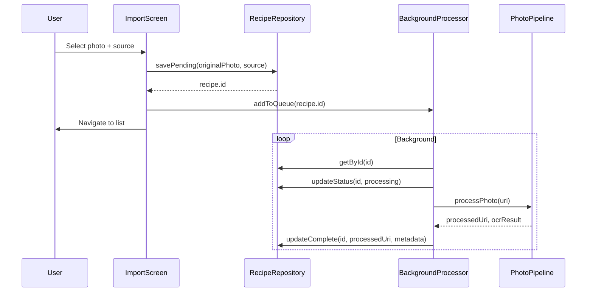

# Background Processing Implementation Plan

## Context

**Current flow:** User selects photo → form screen blocks until processing → user fills metadata → recipe saved.**New flow:** User selects photo → immediate save in pending state → source selection overlay with auto-confirm → background processing → recipe updated when done.**Key files involved:**

- [`lib/types/recipe.ts`](lib/types/recipe.ts) - Recipe type definition
- [`lib/repositories/recipes.ts`](lib/repositories/recipes.ts) - Data persistence
- [`features/photos/hooks/usePhotoImport/index.native.ts`](features/photos/hooks/usePhotoImport/index.native.ts) - Import trigger
- [`app/recipe/add.tsx`](app/recipe/add.tsx) - Current add screen (to be replaced)
- [`lib/photo-processor/pipelines/lighting/illumination.ts`](lib/photo-processor/pipelines/lighting/illumination.ts) - Grayscale conversion (needs color preservation)

---

## Phase 0: Data Model Updates

Extend Recipe type to support processing states and source history tracking.**Changes to [`lib/types/recipe.ts`](lib/types/recipe.ts):**

```typescript
export interface Recipe {
  id: RecipeId;
  photoUri: PhotoUri;
  originalPhotoUri?: PhotoUri; // Keep original for re-processing
  timestamp: number;
  metadata: RecipeMetadata;
  recognizedText?: string;
  status: 'pending' | 'processing' | 'ready'; // New field
}
```

**New file `lib/repositories/sourceHistory.ts`:**

- Store array of `{ source: string, lastUsedAt: number }`
- Provide `getRecentSources()`, `addSource()`, `getLastUsedSource(within24h)`

---

## Phase 1: Background Processing Infrastructure

Create a context-based queue system that persists across screen navigation and app restarts.**New file `features/background-processing/context/BackgroundProcessingContext.tsx`:**

- Queue of pending recipe IDs
- Process one recipe at a time
- Resume unfinished processing on mount (app restart)
- Expose `addToQueue(recipeId)`, `isProcessing(recipeId)`, `processingProgress(recipeId)`

**Data flow:**



**Updates to [`lib/repositories/recipes.ts`](lib/repositories/recipes.ts):**

- Add `savePending()` - creates recipe with `status: 'pending'`, stores original photo
- Add `updateProcessing()` - sets `status: 'processing'`
- Add `updateComplete()` - sets `status: 'ready'`, replaces photo, adds recognized metadata
- Add `getPendingRecipes()` - returns recipes with status !== 'ready' for resume

---

## Phase 2: Source Selector Component

Create a reusable native picker component for source selection.**New file `features/source-selector/components/SourceSelector.tsx`:**

- Uses `@react-native-picker/picker` for native look
- Pre-filled with last source if used within 24 hours
- Shows list of all previously used sources
- "Add new source" option triggers text input modal
- Matches SearchBar positioning (flex: 1, height: 48, borderRadius: 28)

**New file `features/source-selector/hooks/useSourceHistory.ts`:**

- Hook wrapping sourceHistory repository
- Returns `{ sources, lastUsed, addSource, selectSource }`

---

## Phase 3: Import Confirmation Screen

Replace current add recipe form with streamlined photo import confirmation.**New file `app/recipe/import.tsx`:**

- Full-screen photo display
- Bottom overlay with SourceSelector + ConfirmButton
- Positioned identically to index.tsx bottom bar

**New file `features/recipe-import/components/ConfirmButton.tsx`:**

- Circular button (48x48, borderRadius 24) with checkmark icon
- 5-second fill animation (linear left-to-right color inversion)
- Auto-confirms when animation completes
- Resets animation if source selector is interacted with
- Uses `Animated.timing` with `useRef` for timer control

**Screen layout:**

```javascript
+----------------------------------+
|                                  |
|                                  |
|         [Full-screen Photo]      |
|                                  |
|                                  |
+----------------------------------+
|  [Source Selector]  [Confirm ✓]  |  <- Same as bottom bar on list
+----------------------------------+
```

**Update [`features/photos/hooks/usePhotoImport/index.native.ts`](features/photos/hooks/usePhotoImport/index.native.ts):**---

## Phase 4: Photo Pipeline Color Preservation

Modify the lighting pipeline to preserve colors and only use grayscale for OCR.**Changes to [`lib/photo-processor/pipelines/lighting/illumination.ts`](lib/photo-processor/pipelines/lighting/illumination.ts):**Current code converts entire image to grayscale:

```typescript
cv.cvtColor(src, gray, cv.COLOR_BGR2GRAY);
// ... processing ...
cv.cvtColor(normalized, result, cv.COLOR_GRAY2BGR);
```

**New approach - process luminance channel only:**

```typescript
// Convert to LAB color space
cv.cvtColor(src, lab, cv.COLOR_BGR2Lab);
// Split channels, process L channel only
// Merge back and convert to BGR
```

**Changes to [`lib/photo-processor/index.ts`](lib/photo-processor/index.ts):**

- Split pipeline into two outputs:
- `processedUri` - colored image for display/storage
- `ocrImageUri` - grayscale version passed to OCR only (not saved)

---

## Phase 5: Recipe Preview Updates

Redesign preview screen with full-screen image and overlay metadata.

**New layout for [`features/recipe-preview/components/RecipeViewScreen.tsx`](features/recipe-preview/components/RecipeViewScreen.tsx):**

```
+----------------------------------+
|  Recipe Title                    |  <- Large font, semi-transparent bg
|  Recipe Source                   |  <- Smaller font, semi-transparent bg
|  #tag1  #tag2  #tag3             |  <- Smaller font, below source
+----------------------------------+
|                                  |
|                                  |
|      [Full-screen Photo]         |
|                                  |
|                                  |
+----------------------------------+
|                         [Edit ✎] |  <- Bottom left (ready state only)
+----------------------------------+
```

**For `status === 'pending' | 'processing'`:**

- Full-screen photo as background
- ActivityIndicator centered over photo
- SourceSelector + ConfirmButton at bottom (same as import screen)
- No title/tags overlay

**For `status === 'ready'`:**

- Full-screen photo as background
- Top overlay with gradient for readability:
  - Title: larger font (24px), bold, white text with shadow
  - Source: smaller font (14px), italic, white text with shadow
  - Tags: smaller font (14px), displayed horizontally below title
  - Semi-transparent dark gradient background (top to transparent)
- EditButton in bottom-left corner

**New file `features/recipe-preview/components/MetadataOverlay.tsx`:**

- Absolute positioned container at top
- LinearGradient background (rgba(0,0,0,0.6) → transparent)
- Title and source with text shadow for legibility
- Horizontal tag list with smaller font

**Changes to [`lib/components/atoms/EditButton.tsx`](lib/components/atoms/EditButton.tsx):**

- Update positioning: bottom: 16, left: 16 (instead of top: 16, right: 16)
- Match dimensions with AddRecipeButton (48x48, borderRadius 24)
- Use GlassView for consistency

---

## Phase 6: Edit Form Updates

Update edit form to use SourceSelector and pre-populate from recognized data.**Changes to [`features/recipe-form/components/MetadataFormFields.tsx`](features/recipe-form/components/MetadataFormFields.tsx):**

- Replace source FormInput with SourceSelector component
- SourceSelector pre-populated with current recipe.metadata.source

**Changes to [`features/recipe-form/components/EditRecipeForm.tsx`](features/recipe-form/components/EditRecipeForm.tsx):**

- Form pre-populated with:
- `title` from OCR classification result
- `tags` from OCR classification result  
- `source` from user selection during import
- Submit button already says "Save changes" (existing)

---

## Migration Considerations

- Existing recipes without `status` field default to `'ready'`
- Add migration in [`lib/repositories/photosToRecipesMigration.ts`](lib/repositories/photosToRecipesMigration.ts)

---

## New Translation Keys

Add to [`platform/i18n/translations/en.json`](platform/i18n/translations/en.json):

```json
{
  "sourceSelector": {
    "placeholder": "Select source",
    "addNew": "Add new source",
    "addNewTitle": "New Source",
    "addNewPlaceholder": "Enter source name or URL"
  },
  "import": {
    "confirmHint": "Confirming in {seconds}s..."
  }
}


```