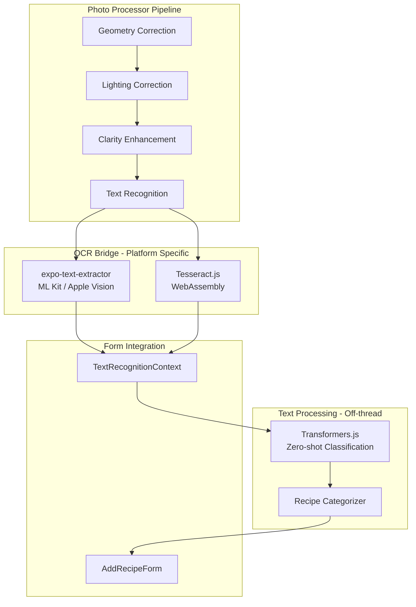

# Text Recognition Pipeline Implementation

## Architecture Overview



## Key Files to Create/Modify

| File | Action | Purpose |

|------|--------|---------|

| `lib/photo-processor/pipelines/text-recognition/` | Create | New OCR pipeline directory |

| `lib/photo-processor/ocr-bridge/` | Create | Platform-specific OCR implementations |

| `features/text-recognition/` | Create | Context and hooks for text processing |

| `lib/photo-processor/index.ts` | Modify | Add OCR phase to pipeline |

| `app/recipe/add.tsx` | Modify | Integrate text recognition context |

| `features/recipe-form/components/AddRecipeForm.tsx` | Modify | Accept extracted data props |

## Implementation Details

### Phase 1: OCR Bridge Layer

Create platform-specific OCR implementations following the existing `opencv-bridge` pattern:

- **Native** (`index.native.ts`): Use `expo-text-extractor` with `extractTextFromImage(uri)`
- **Web** (`index.web.ts`): Use `tesseract.js` with a Web Worker for off-thread processing
- **Types** (`types.ts`): Define `OcrResult` interface with extracted text and confidence

### Phase 2: Text Recognition Pipeline

Create a new pipeline in `lib/photo-processor/pipelines/text-recognition/`:

- Returns the **same image** as input (passthrough)
- Stores extracted text in a result object for downstream processing
- Follows existing pipeline patterns (async, error handling)

### Phase 3: Recipe Text Processing

Use `@huggingface/transformers` for zero-shot classification:

```typescript
// Example model usage
const classifier = await pipeline('zero-shot-classification', 'Xenova/mobilebert-uncased-mnli');

// Classify by season
const seasonResult = await classifier(extractedText, [
  'spring recipe', 'summer recipe', 'autumn recipe', 'winter recipe'
]);

// Classify by cuisine  
const cuisineResult = await classifier(extractedText, [
  'italian', 'french', 'spanish', 'greek', 'chinese', 'japanese', 
  'korean', 'thai', 'indian', 'mexican', 'turkish', 'lebanese'
  // ... full list of 25 cuisines
]);

// Classify by food category
const categoryResult = await classifier(extractedText, [
  'appetizer', 'soup', 'salad', 'pasta', 'pizza', 'dessert', 'pastry'
  // ... full list of 15 categories
]);
```

Run in a Web Worker to avoid blocking the UI thread.

### Phase 4: Context and Form Integration

Create `TextRecognitionContext` to:

- Store extracted text and parsed recipe data
- Provide loading/processing states
- Expose extracted title, ingredients, and suggested tags

Modify `AddRecipeForm` to:

- Accept optional `extractedData` prop
- Pre-populate title field when extracted
- Pre-populate tags with confidence >= 80%

### Phase 5: Tag Categorization

Implement categorization using comprehensive label sets:

#### Seasons (4 labels)

`spring`, `summer`, `autumn`, `winter`

#### Cuisines (25 labels - standard culinary taxonomy)

| Region | Cuisines |

|--------|----------|

| **European** | italian, french, spanish, greek, german, british, polish, scandinavian |

| **Asian** | chinese, japanese, korean, thai, vietnamese, indian, indonesian |

| **Middle Eastern** | turkish, lebanese, persian, moroccan |

| **Americas** | mexican, american, brazilian, cajun |

| **Other** | caribbean, african |

#### Food Categories (15 labels)

`appetizer`, `soup`, `salad`, `pasta`, `pizza`, `rice`, `stew`, `roast`, `grill`, `stir-fry`, `baked`, `pastry`, `dessert`, `beverage`, `preserves`

Each tag evaluated independently against 80% confidence threshold.

## Dependencies to Add

```json
{
  "expo-text-extractor": "0.2.2",
  "tesseract.js": "6.0.1",
  "@huggingface/transformers": "3.8.1"
}
```

## Processing Flow

1. Photo enters processor pipeline
2. After clarity enhancement, OCR extracts text
3. Text sent to `TextRecognitionContext` 
4. Background worker runs Transformers.js classification
5. Results update context with extracted title and suggested tags
6. Form observes context and pre-populates fields when confidence >= 80%